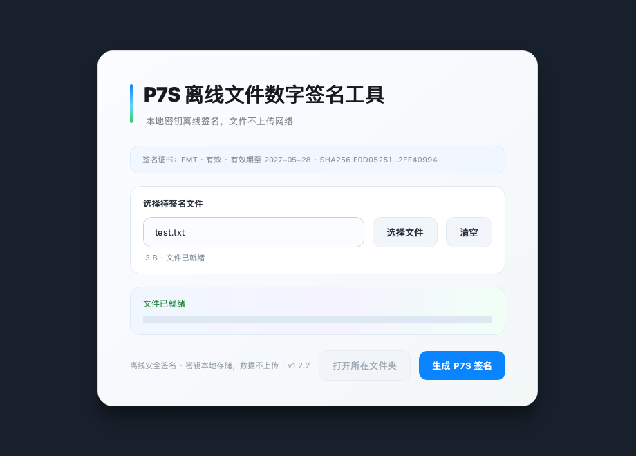

# P7S 离线文件数字签名工具

版本：v1.2.2 | Released: 2026-06-30

这是一个面向企业内部使用场景的离线 P7S 文件数字签名桌面工具。工具使用本地私钥和证书对任意格式文件生成 detached `.p7s` 签名文件，文件内容不会上传网络。

当前实现采用 PySide6 构建桌面 GUI，签名核心逻辑独立封装在 `signing_service.py` 中。签名能力通过 `cryptography` 调用 OpenSSL 相关库能力完成，不直接调用 `openssl` 命令行程序。

## 界面预览
<p align="center">
  
</p>

## 功能概览

- 选择或拖拽本地任意格式文件进行签名。
- 使用本目录下的 `private_key.pem` 和 `user.crt` 完成离线签名。
- 输出 detached DER PKCS#7 / P7S 签名文件。
- 默认保存位置建议为桌面，也可以由用户选择任意目录。
- 签名前校验证书和私钥：
  - 私钥文件是否存在；
  - 证书文件是否存在；
  - 私钥和证书是否匹配；
  - 证书是否在有效期内。
- 签名过程中使用后台线程，避免 GUI 卡死。
- 读取文件阶段提供基于字节进度的进度条。
- 保存文件前检查同名覆盖。
- 使用临时文件 + 原子替换方式写入 `.p7s`，降低异常中断导致半截文件的风险。
- 签名完成后自动执行本地验签。
- 自动记录本地审计日志。
- 支持打开签名文件所在文件夹。
- 支持清空当前文件选择。
- 支持将单个本地文件拖拽到界面中，视为选择文件。
- 证书异常时禁用签名按钮，避免误操作。

## 项目结构

```text
.
├── p7s_signer.py              # PySide6 GUI 入口
├── signing_service.py         # 签名、验签、证书校验、审计日志核心逻辑
├── test_signing_service.py    # 轻量级回归测试脚本
├── requirements.txt           # Python 依赖
├── private_key.pem            # 签名私钥
├── user.crt                   # 签名证书
├── test.txt                   # 回归测试样例文件
└── logs/
    └── signing_audit.jsonl    # 运行后自动生成的审计日志
```

## 运行环境

建议环境：

- Python 3.9+
- macOS 或 Windows
- 本地可安装 Python 包

依赖：

```text
cryptography>=44,<50
PySide6>=6.6,<7
```

## 安装依赖

如果使用全局或虚拟环境：

```bash
python3 -m pip install -r requirements.txt
```

如果希望依赖安装在项目本地目录，便于拷贝和隔离：

```bash
python3 -m pip install --target .python-packages -r requirements.txt
```

程序启动时会优先识别当前目录下的 `.python-packages`。

## 启动工具

在项目目录执行：

```bash
python3 p7s_signer.py
```

启动后界面会显示：

- 工具标题；
- 离线安全说明；
- 当前签名证书摘要；
- 文件选择区域；
- 签名状态；
- 进度条；
- 生成签名按钮；
- 打开签名文件所在文件夹按钮；
- 清空按钮。

## 使用流程

1. 确认 `private_key.pem` 和 `user.crt` 放在工具同级目录。
2. 启动 `p7s_signer.py`。
3. 检查界面中的证书状态是否为“有效”。
4. 点击“选择文件”，或将单个本地文件拖拽到工具卡片区域。
5. 文件选择成功后，输入框中显示文件名；鼠标悬浮可查看完整绝对路径。
6. 点击“生成 P7S 签名”。
7. 在保存弹窗中选择 `.p7s` 输出位置。
8. 如目标文件已存在，工具会弹窗确认是否覆盖。
9. 签名完成后，工具会自动验签。
10. 验签通过后显示成功弹窗，并可点击“打开所在文件夹”。

## 输出文件说明

输出文件格式：

```text
原文件名.p7s
```

示例：

```text
contract.pdf.p7s
```

当前输出为 detached DER PKCS#7 / P7S 签名文件。原文件内容不会被嵌入 `.p7s` 文件中，验签时通常需要同时提供原文件和 `.p7s` 签名文件。

## 自动验签说明

工具在生成 `.p7s` 后会立即进行本地自动验签。

当前自动验签器的设计边界：

- 用于校验本工具刚生成的 `.p7s` 文件；
- 支持当前工具输出格式：DER、detached、binary、no signed attributes；
- 支持当前签名服务使用的单证书签名场景；
- 不承诺作为通用 CMS / PKCS#7 验签器验证任意外部 `.p7s` 文件。

如果后续需要验证第三方平台生成的 `.p7s`，建议新增独立的“通用验签模块”，不要复用当前自动验签器作为泛化验签能力。

## 审计日志

工具会写入本地 JSONL 审计日志：

```text
logs/signing_audit.jsonl
```

成功签名记录字段包括：

- `event`: `sign_success`
- `time`: UTC 时间
- `source_name`: 原文件名
- `source_path`: 原文件路径
- `source_sha256`: 原文件 SHA256
- `signature_path`: 签名文件路径
- `signature_sha256`: 签名文件 SHA256
- `certificate_subject`: 证书主体
- `certificate_fingerprint_sha256`: 证书 SHA256 指纹
- `verified`: 自动验签结果

失败记录字段包括：

- `event`: `sign_failure`
- `time`: UTC 时间
- `source_name`
- `source_path`
- `signature_path`
- `error_type`
- `error`

安全注意：

- 日志不记录私钥内容；
- 日志不记录文件正文内容；
- 日志会记录文件路径和摘要，如路径本身敏感，需要按企业内部安全要求保护 `logs` 目录。

## 回归测试

执行：

```bash
python3 test_signing_service.py
```

测试覆盖：

- 正常签名；
- 自动验签；
- 证书信息读取；
- 审计日志写入；
- 输入文件不存在异常；
- 输出目录不存在异常。

预期输出类似：

```text
PASS test_normal_signing_and_verification
PASS test_certificate_info
PASS test_audit_log
PASS test_missing_input_file
PASS test_missing_output_directory
全部签名服务回归测试通过。
```

## Windows EXE 打包

项目已提供 Windows 一键打包脚本：

```text
build_exe.bat
```

由于 PyInstaller 通常不能跨平台打包，Windows `.exe` 需要在 Windows 系统中生成。也就是说：

- 在 Windows 上运行 `build_exe.bat`，生成 `.exe`；
- 在 macOS 上只能生成 macOS 可执行程序或 `.app`，不能直接生成 Windows `.exe`；
- 当前项目已提供 Windows 打包配置，拷贝到 Windows 后可直接构建。

### Windows 打包前置条件

建议环境：

- Windows 10 / Windows 11；
- Python 3.9+；
- 安装 Python 时勾选 `Add Python to PATH`；
- 项目目录中存在：
  - `p7s_signer.py`
  - `signing_service.py`
  - `private_key.pem`
  - `user.crt`
  - `requirements.txt`
  - `requirements-build.txt`
  - `p7s_signer.spec`
  - `build_exe.bat`

### 一键打包

在 Windows 文件资源管理器中双击：

```text
build_exe.bat
```

或在命令提示符中执行：

```bat
build_exe.bat
```

脚本会自动执行：

1. 检查 Python；
2. 创建 `.venv-build` 打包虚拟环境；
3. 安装运行依赖和 PyInstaller；
4. 执行 `test_signing_service.py` 回归测试；
5. 使用 `p7s_signer.spec` 构建单文件 exe。

构建成功后输出：

```text
dist\P7S离线文件数字签名工具.exe
```

### 打包配置说明

打包配置文件：

```text
p7s_signer.spec
```

当前配置为：

- 单文件 exe；
- 无控制台窗口；
- 内置 `private_key.pem`；
- 内置 `user.crt`;
- 自动包含 PySide6 和 cryptography 相关依赖；
- 输出文件名为 `P7S离线文件数字签名工具.exe`。

### EXE 运行时目录说明

打包后的 exe 会把证书和私钥作为资源读取。审计日志不会写入 PyInstaller 临时解包目录，而是写到 exe 所在目录：

```text
dist\logs\signing_audit.jsonl
```

如果将 exe 移动到其他目录，日志会跟随写入新的 exe 所在目录下的 `logs` 文件夹。

### 私钥打包安全提醒

当前 `p7s_signer.spec` 会把 `private_key.pem` 和 `user.crt` 打进 exe，符合“离线工具开箱即用”的交付方式，但这不是最高安全等级方案。

如果用于生产环境，应明确接受以下风险：

- 私钥随 exe 分发，任何拿到 exe 的人理论上都持有签名能力；
- exe 被复制后，签名能力也被复制；
- 不适合高安全等级的 CA、HSM、USB Key 场景。

更安全的生产方案是：

- 私钥不打包进 exe，改为外部受控路径；
- 使用加密私钥并要求用户输入口令；
- 使用 Windows 证书存储；
- 使用 USB Key；
- 使用 HSM。

如需改成“exe 不内置私钥，运行时读取外部 `private_key.pem/user.crt`”，需要调整 `p7s_signer.spec` 和 `p7s_signer.py` 的资源路径策略。

## macOS APP 打包

项目已提供 macOS `.app` 专用打包配置：

```text
p7s_signer_macos.spec
build_macos_app.sh
```

macOS `.app` 可以在 macOS 本机直接生成。当前项目所在机器是 macOS arm64，因此适合生成 Apple Silicon 版本 `.app`。如果需要同时支持 Intel Mac，应在 Intel Mac 上单独打包，或使用合适的 universal2 Python/PySide6 环境重新构建。

### macOS 打包前置条件

建议环境：

- macOS 12+；
- Python 3.9+；
- 可访问 Python 包安装源；
- 项目目录中存在：
  - `p7s_signer.py`
  - `signing_service.py`
  - `private_key.pem`
  - `user.crt`
  - `requirements.txt`
  - `requirements-build.txt`
  - `p7s_signer_macos.spec`
  - `build_macos_app.sh`

### 一键打包

在项目目录执行：

```bash
chmod +x build_macos_app.sh
./build_macos_app.sh
```

脚本会自动执行：

1. 检查 Python；
2. 创建 `.venv-build-macos` 打包虚拟环境；
3. 安装运行依赖和 PyInstaller；
4. 执行 `test_signing_service.py` 回归测试；
5. 使用 `p7s_signer_macos.spec` 构建 `.app`；
6. 如系统存在 `codesign`，执行 ad-hoc 签名。

构建成功后输出：

```text
dist/P7S离线文件数字签名工具.app
```

### APP 运行时目录说明

打包后的 `.app` 会把 `private_key.pem` 和 `user.crt` 作为资源读取。审计日志不会写入 PyInstaller 临时目录，也不会写入 `.app` 包内部，而是写入 macOS 用户应用数据目录：

```text
~/Library/Application Support/P7S离线文件数字签名工具/logs/
```

这样可以避免运行时修改 `.app` 包内容，降低破坏应用签名和分发完整性的风险。

### macOS Gatekeeper 说明

当前脚本只做 ad-hoc codesign，不做 Apple Developer ID 签名和 notarization。因此：

- 本机运行通常可用；
- 拷贝到其他 Mac 后，可能被 Gatekeeper 提示“无法验证开发者”；
- 企业内部分发时建议使用 Apple Developer ID 证书签名并 notarize；
- 或通过企业 MDM/白名单方式分发。

### 私钥打包安全提醒

macOS `.app` 当前同样会内置 `private_key.pem` 和 `user.crt`。这便于离线交付，但安全边界与 Windows exe 相同：拿到 `.app` 的人理论上也拿到了签名能力。

如果生产环境不能接受该风险，应改为外部受控私钥、加密私钥口令、系统钥匙串、USB Key 或 HSM。

## 大文件说明

当前读取阶段按 1 MiB 分块读取并更新进度条，但 `cryptography` 的 PKCS#7 公开 API 在构建签名时仍需要将原文件内容作为 `bytes` 传入，因此实际签名阶段仍会占用内存。

工具内置推荐阈值为 512 MB：

- 小于等于 512 MB：正常使用；
- 大于 512 MB：界面会提示“大文件签名可能占用较多内存”。

如果未来需要稳定处理数 GB 级文件，应评估真正流式 CMS 签名方案或引入专门的底层 OpenSSL BIO/CMS 封装。

## 常见问题

### 1. 界面显示“证书状态：不可用”

可能原因：

- `private_key.pem` 不存在；
- `user.crt` 不存在；
- 私钥文件损坏；
- 证书文件损坏；
- 证书已过期或尚未生效；
- 私钥与证书不匹配。

处理方式：

1. 确认两个文件与 `p7s_signer.py` 在同一目录；
2. 确认证书仍在有效期内；
3. 确认私钥和证书来自同一对密钥材料；
4. 修复后重新启动工具。

### 2. 选择文件后“生成 P7S 签名”按钮仍不可点击

如果证书不可用，工具会强制禁用签名按钮。请先修复证书或私钥问题。

### 3. 签名失败：没有读取文件权限

请检查：

- 文件是否仍存在；
- 文件是否被其他程序独占；
- 当前用户是否有读取权限；
- 文件是否位于受系统保护的位置。

### 4. 写入签名文件失败

请检查：

- 保存目录是否存在；
- 当前用户是否有写入权限；
- 磁盘空间是否足够；
- 目标文件是否被其他程序占用。

### 5. 自动验签失败

可能原因：

- 原文件在签名过程中被替换或修改；
- `.p7s` 文件写入异常；
- 证书或私钥材料被替换；
- 当前 `.p7s` 不是本工具生成的 no-attributes detached DER 格式。

建议重新选择原文件并重新生成签名。如果仍失败，应检查证书、私钥和文件完整性。

## 安全说明

当前版本遵循“离线签名”设计：

- 不上传文件；
- 不访问网络；
- 不调用外部命令行 `openssl`；
- 签名私钥只从本地 `private_key.pem` 读取；
- 审计日志不保存文件内容和私钥内容。

仍需注意：

- 私钥以文件形式放在工具目录，生产环境应限制目录访问权限；
- 如果私钥需要更高安全等级，建议后续改为加密私钥 + 启动口令、系统钥匙串、USB Key 或 HSM；
- 不建议将真实生产私钥提交到代码仓库；
- 分发工具时应单独管理密钥材料。

## 版本升级历史

### v1.2.2：文件区提示精简版本

本版本优化文件区域文案密度和拖拽状态提示：

- 将“支持任意文件格式”和“可拖拽文件”合并为一行辅助提示；
- 拖拽悬停时仅在文件区域显示“释放鼠标以上传文件”；
- 状态面板不再重复显示同一句拖拽提示，避免信息冗余；
- 版本号升级至 v1.2.2。

### v1.2.1：苹果浅色系色彩优化版本

本版本在 v1.2.0 的结构层级基础上补充更柔和的色彩表达：

- 引入苹果风格浅色系：主蓝、天蓝、薄荷绿、淡紫；
- 主卡片使用更柔和的浅色渐变，增强空气感；
- 标题品牌线改为蓝—青—绿的细腻过渡；
- 证书信息条、文件投放区、状态面板分别使用浅蓝、白色、蓝紫绿轻量底色；
- 进度条使用蓝—青—绿过渡，表达安全完成感；
- 主按钮切换为更接近 Apple Blue 的色彩体系；
- 保持低饱和和专业克制，避免花哨装饰；
- 版本号升级至 v1.2.1。

### v1.2.0：视觉设计升级版本

本版本聚焦界面精致度与视觉层次：

- 重构主卡片比例、内边距和阴影层次；
- 增加标题左侧商务蓝品牌线，强化视觉识别；
- 将文件选择区升级为独立投放模块，拖拽区域更明确；
- 将状态和进度区升级为独立状态面板；
- 优化字体层级、字号、字重和中性色搭配；
- 使用更深的海军灰背景、更柔和的白色卡片和更克制的商务蓝；
- 统一按钮圆角、边框、hover、pressed、disabled 状态；
- 保持企业安全工具的专业克制，同时增强精致感和艺术气息；
- 版本号升级至 v1.2.0。

### v1.1.1：拖拽提示优化版本

本版本补充拖拽功能的可发现性提示：

- 在文件选择区域下方增加常驻提示：“也可以将单个本地文件拖拽到此区域”；
- 拖拽悬停时提示切换为“释放鼠标以上传文件”；
- 拖拽悬停时提示文字变为商务蓝色，和卡片高亮保持一致；
- 版本号升级至 v1.1.1。

### v1.1.0：拖拽上传增强版本

本版本增加桌面工具常用的拖拽交互能力：

- 支持将单个本地文件拖拽到主卡片区域；
- 拖拽文件复用原有文件选择校验逻辑；
- 拖拽悬停时显示轻量蓝色高亮和状态提示；
- 签名过程中拒绝拖入新文件，避免状态混乱；
- 多文件、文件夹、非本地 URL 不作为有效输入；
- 签名完成后拖入新文件会自动切换文件并恢复签名按钮状态；
- 版本号升级至 v1.1.0。

### v1.0.0：交付收尾版本

本版本完成从原型到可交付工具的关键收尾：

- 增加正式版本号；
- 在界面底部显示版本信息；
- 证书异常时禁用签名按钮；
- 新增详细 README；
- 新增轻量级回归测试脚本；
- 明确自动验签能力边界；
- 保留本地审计日志；
- 保留签名后自动验签；
- 保留 PySide6 现代化 GUI。

### v0.9.x：审计与自动验签增强阶段

该阶段围绕企业内部安全工具的可追溯性和可靠性增强：

- 签名完成后自动验签；
- 增加证书主体、有效期、SHA256 指纹展示；
- 增加本地 JSONL 审计日志；
- 增加大文件内存占用提示；
- 增强验签失败提示；
- 明确审计日志不记录私钥和文件内容。

### v0.8.x：PySide6 GUI 迁移阶段

该阶段将原 tkinter 桌面界面完整迁移为 PySide6：

- 使用 `QMainWindow`、`QVBoxLayout`、`QHBoxLayout` 重建界面；
- 使用 QSS 实现深色背景、白色卡片、圆角控件、商务蓝主按钮；
- 使用 `QThread` + Qt 信号槽替代 queue 多线程通信；
- 签名期间禁用按钮，避免重复提交；
- 选择文件后只展示文件名，完整路径放入 tooltip；
- 签名成功后禁用主按钮，选择新文件后才恢复；
- 增加清空按钮；
- 增加打开签名文件所在文件夹按钮。

### v0.7.x：业务逻辑解耦阶段

该阶段将签名核心从 GUI 中拆出：

- 新增 `P7SSigningService`；
- GUI 只负责交互、状态展示和弹窗；
- 签名服务负责证书/私钥读取、校验、签名、原子写入；
- 为后续批量签名、验签、多证书切换预留结构。

### v0.6.x：库函数签名阶段

该阶段移除直接调用命令行 `openssl` 的实现，改为通过 Python 库调用 OpenSSL 相关能力：

- 使用 `cryptography` 的 PKCS#7 builder；
- 生成 DER detached `.p7s`；
- 保留 SHA256 签名；
- 保留 binary 和 detached 签名选项。

### v0.5.x：健壮性增强阶段

该阶段主要修复体验和稳定性问题：

- 增加文件覆盖确认；
- 增加临时文件原子写入；
- 增加失败后的临时文件清理；
- 增加更细粒度异常类型；
- 增加文件读取字节级进度回调。

### v0.1.x：初始原型阶段

初始版本完成最小可用流程：

- 选择文件；
- 点击签名；
- 生成 `.p7s`；
- 弹窗提示成功或失败；
- 初始 GUI 为 tkinter 实现；
- 早期版本曾使用命令行 OpenSSL，后续已移除。

## 后续建议

如果继续迭代，建议优先考虑：

1. 正式打包 macOS `.app` 和 Windows `.exe`；
2. 增加应用图标和签名；
3. 支持加密私钥口令输入；
4. 支持多证书切换；
5. 支持批量签名；
6. 新增通用 `.p7s` 验签页面；
7. 增加日志目录打开入口；
8. 增加企业内部配置文件，例如默认输出目录、日志目录、证书路径。
